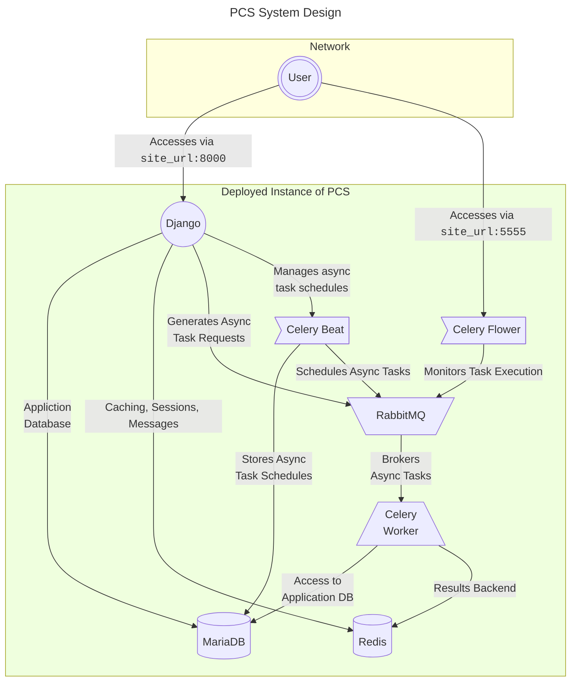

# Contributors Guide

The following diagrams the high level system interaction of the Programming Contest Suite.

```mermaid
---
title: PCS System Design
---
graph TD

    subgraph pcs [Deployed Instance of PCS]
    
    A((Django))
    A-->|Appliction<br>Database| C[(MariaDB)]
    A-->|Caching, Sessions, Messages| D[(Redis)]
    A--> |Generates Async<br>Task Requests|E[\RabbitMQ/]

    B[/Celery<br>Worker\]-->|Access to<br>Application DB| C
    B-->|Results Backend| D
    E-->|Brokers<br>Async Tasks| B

    F>Celery Flower]-->|Monitors Task Execution| E

    G>Celery Beat]-->|Stores Async<br>Task Schedules| C
    G-->|Schedules Async Tasks| E
    A-->|Manages async<br>task schedules| G
    end

    subgraph world [Network]
    X(((User)))-->|Accesses via <code>site_url:8000</code>| A
    X-->|Accesses via <code>site_url:5555</code>| F  
    end

    classDef green fill:#EFFFDE

    class pcs green
```
