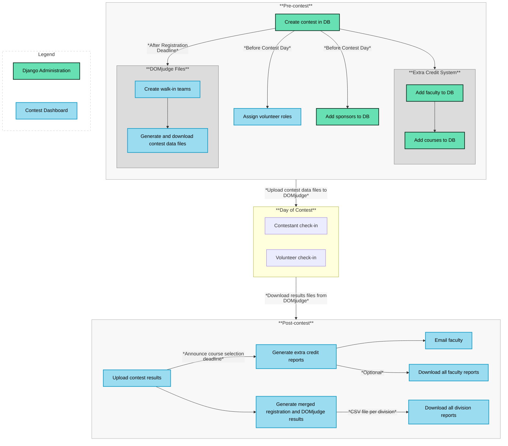

# Welcome to the Contest Administration Manual!

The Programming Contest Suite (PCS) is designed to ease the administration of a programming contest hosted with the [DOMjudge](https://www.domjudge.org/) jury system by facilitating contest registration and management, generating contest data files required by DOMjudge, and processing contest results exported from DOMjudge. The articles comprising this manual document how to host a programming contest with the PCS. 

{: .important-title }
> Management Interfaces
>
> A contest is managed through Django Administration and the [Contest Dashboard]({{ site.url }}/usage/contest_administration/contest_dashboard.html). 

## Administration Flowchart

The following diagram outlines the actions performed by contest administrators throughout the process of hosting a contest.

